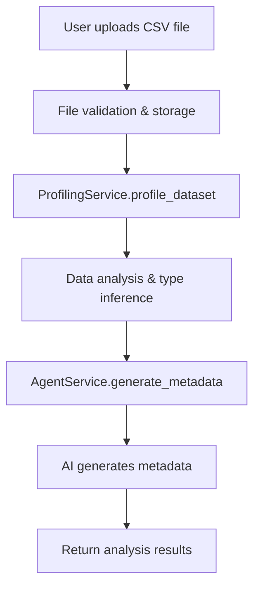
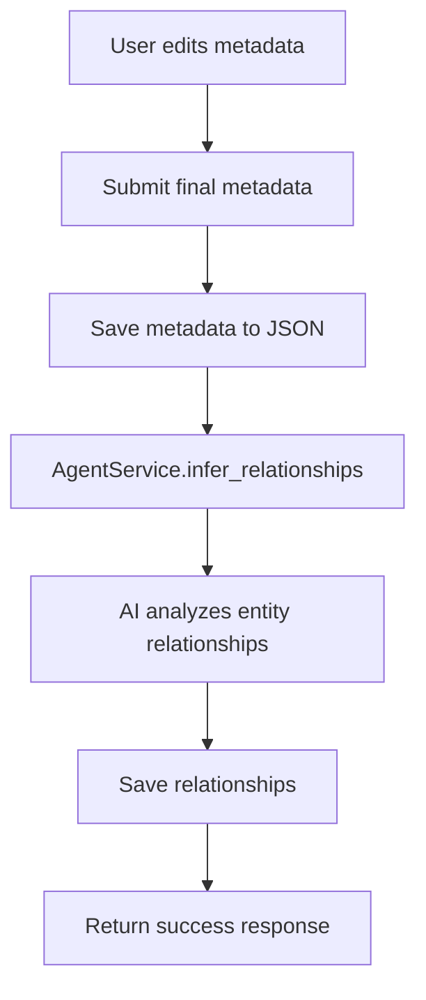
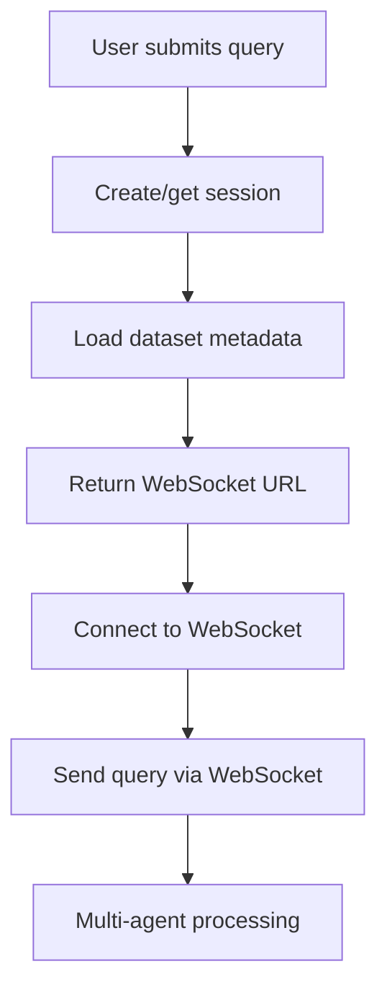
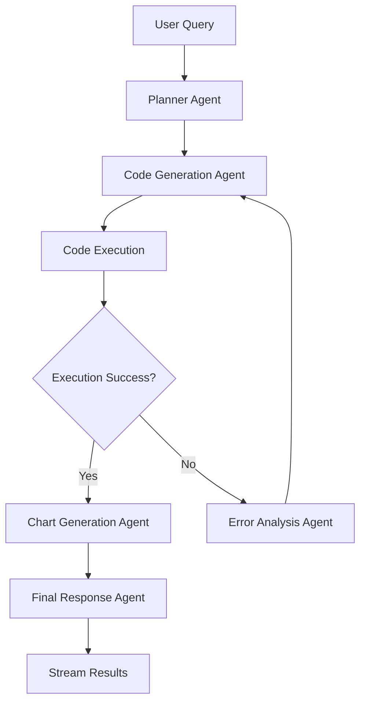

# AI-Powered Logistics Assistant - Complete Codebase Overview

## 🏗️ Project Architecture Overview

This is a sophisticated AI-powered logistics assistant built with a **two-phase modular architecture**:

### **Phase 1: Metadata Generation & Dataset Analysis**
- Automated data profiling and type conversion analysis
- AI-powered metadata generation using LLMs
- Relationship inference between data entities
- RESTful API with file upload support

### **Phase 2: Natural Language Querying**
- Multi-agent system using LangGraph
- Real-time WebSocket streaming
- Safe code execution in Jupyter kernels
- Interactive chat interface for data analysis

---

## 📁 Project Structure

```
Rusty/
├── app/                          # Backend application
│   ├── main.py                  # FastAPI entry point
│   ├── api/                     # API layer
│   │   ├── routes.py           # Phase 1 endpoints
│   │   └── phase2_routes.py    # Phase 2 endpoints
│   ├── services/               # Business logic layer
│   │   ├── profiling_service.py    # Data profiling & type analysis
│   │   ├── agent_service.py        # Phase 1 AI agent
│   │   ├── multi_agent_service.py  # Phase 2 multi-agent system
│   │   ├── session_service.py      # Session management
│   │   ├── jupyter_service.py      # Code execution
│   │   └── websocket_service.py    # Real-time streaming
│   ├── models/                 # Data models & schemas
│   ├── config/                 # Configuration management
│   ├── utils/                  # Utility functions
│   └── prompts/                # LLM prompt templates
├── frontend/                   # React + TypeScript frontend
│   └── src/
│       ├── components/         # UI components
│       ├── services/           # API services
│       └── types/              # TypeScript types
├── datasets/                   # Sample datasets
├── metadata/                   # Saved metadata files
├── temp_data/                  # Session data storage
└── uploads/                    # File upload storage
```

---

## 🔄 Complete Application Flow

### **Phase 1: Dataset Analysis Flow**

#### 1. **File Upload/Analysis Request** (`/v1/analyze`)


**What happens internally:**

1. **File Handling** (`routes.py:handle_file_upload`):
   - Validates file type (CSV only)
   - Checks file size (50MB limit)
   - Generates safe filename with timestamp
   - Saves to `uploads/` directory

2. **Data Profiling** (`profiling_service.py:profile_dataset`):
   - Reads CSV with pandas
   - Analyzes dataset size, missing values
   - Performs type inference and correction suggestions
   - Generates statistics and data quality reports
   - Creates `AgentInput` object with structured data

3. **AI Metadata Generation** (`agent_service.py:generate_metadata`):
   - Uses OpenAI GPT model
   - Processes structured data through LLM prompts
   - Generates human-readable column descriptions
   - Returns JSON metadata with column classifications

#### 2. **Metadata Finalization** (`/v1/metadata/finalize`)


**What happens internally:**

1. **Metadata Persistence**:
   - Saves user-corrected metadata to `metadata/` directory
   - Ensures canonical schema with dataset name

2. **Relationship Inference** (`agent_service.py:infer_relationships`):
   - Uses structured output with Pydantic models
   - Analyzes column relationships and entity structure
   - Identifies primary/foreign keys
   - Groups related metrics
   - Saves relationships to separate JSON file

### **Phase 2: Natural Language Querying Flow**

#### 1. **Query Session Creation** (`/v2/query`)


**What happens internally:**

1. **Session Management** (`session_service.py`):
   - Creates unique session ID
   - Initializes Jupyter kernel for code execution
   - Stores conversation history
   - Manages session lifecycle

2. **WebSocket Connection** (`websocket_service.py`):
   - Establishes real-time communication
   - Handles message routing
   - Manages multiple concurrent sessions

#### 2. **Multi-Agent Query Processing**


**What happens internally:**

1. **Planner Agent** (`multi_agent_service.py:_planner_agent`):
   - Breaks down complex queries into steps
   - Creates execution plan
   - Determines required data transformations

2. **Code Generation Agent** (`multi_agent_service.py:_code_generation_agent`):
   - Uses ReAct methodology
   - Generates Python code for data analysis
   - Includes error handling and validation

3. **Code Execution** (`jupyter_service.py`):
   - Executes code in isolated Jupyter kernel
   - Maintains variable state across queries
   - Handles pandas, numpy, plotly operations

4. **Error Analysis Agent** (`multi_agent_service.py:_error_analysis_agent`):
   - Diagnoses execution errors
   - Suggests code fixes
   - Provides debugging information

5. **Chart Generation Agent** (`multi_agent_service.py:_chart_generation_agent`):
   - Creates Plotly visualizations
   - Generates interactive charts
   - Optimizes chart appearance

6. **Final Response Agent** (`multi_agent_service.py:_final_response_agent`):
   - Synthesizes all results
   - Creates human-readable summary
   - Formats final response with charts

---

## 🛠️ Key Services Deep Dive

### **ProfilingService** (`app/services/profiling_service.py`)
**Purpose**: Comprehensive dataset analysis and type conversion

**Core Methods**:
- `profile_dataset()`: Main entry point for analysis
- `_infer_type_corrections()`: Advanced type inference
- `_analyze_single_column()`: Column-specific analysis

**What it does**:
1. **Data Quality Analysis**:
   - Missing value detection and reporting
   - Statistical analysis (mean, std, percentiles)
   - Data type validation and suggestions

2. **Type Conversion Logic**:
   - Numeric detection (threshold-based)
   - Datetime pattern recognition
   - Categorical value analysis
   - ID column identification

3. **Sample Data Generation**:
   - Creates representative data samples
   - Handles large datasets efficiently
   - Preserves data privacy

### **AgentService** (`app/services/agent_service.py`)
**Purpose**: AI-powered metadata generation and relationship inference

**Core Methods**:
- `generate_metadata()`: Creates column descriptions
- `infer_relationships()`: Analyzes entity relationships

**What it does**:
1. **Metadata Generation**:
   - Uses structured prompts with LangChain
   - Processes column data types and samples
   - Generates human-readable descriptions
   - Classifies columns (Numerical, Categorical, etc.)

2. **Relationship Inference**:
   - Uses Pydantic structured output
   - Identifies entity relationships
   - Maps primary/foreign keys
   - Groups related metrics

### **MultiAgentService** (`app/services/multi_agent_service.py`)
**Purpose**: Orchestrates multi-agent workflow for natural language queries

**Core Components**:
- **LangGraph Workflow**: State-based agent coordination
- **5 Specialized Agents**: Each with specific responsibilities
- **Conditional Execution**: Dynamic workflow routing

**Agent Responsibilities**:

1. **Planner Agent**:
   - Analyzes user intent
   - Creates step-by-step execution plan
   - Determines required data operations

2. **Code Generation Agent**:
   - Generates Python code using ReAct
   - Includes pandas/numpy operations
   - Handles data loading and transformation

3. **Error Analysis Agent**:
   - Diagnoses execution failures
   - Suggests code corrections
   - Provides debugging context

4. **Chart Generation Agent**:
   - Creates Plotly visualizations
   - Optimizes chart types for data
   - Generates interactive plots

5. **Final Response Agent**:
   - Synthesizes all results
   - Creates comprehensive summary
   - Formats final response

### **SessionService** (`app/services/session_service.py`)
**Purpose**: Manages user sessions and Jupyter kernels

**Core Features**:
- **Session Lifecycle Management**: Create, track, cleanup
- **Jupyter Kernel Management**: Isolated execution environments
- **Conversation History**: Context preservation across queries
- **Resource Cleanup**: Automatic session expiration

### **WebSocketService** (`app/services/websocket_service.py`)
**Purpose**: Real-time communication and streaming

**Core Features**:
- **Connection Management**: Multiple concurrent sessions
- **Message Routing**: Type-based message handling
- **Streaming**: Real-time agent thought streaming
- **Error Handling**: Graceful connection management

---

## 🎨 Frontend Architecture

### **React + TypeScript Structure**
```
frontend/src/
├── components/
│   ├── Phase1.tsx              # Main Phase 1 interface
│   ├── FileUpload.tsx          # File upload component
│   ├── AnalysisResults.tsx     # Results display
│   ├── MetadataEditor.tsx      # Metadata editing
│   └── chat/
│       └── ChatInterface.tsx   # Phase 2 chat interface
├── services/
│   └── api.ts                  # API client functions
└── types/
    └── api.ts                  # TypeScript type definitions
```

### **User Interface Flow**

#### **Phase 1 Interface**:
1. **File Input**: Upload CSV or provide file path
2. **Analysis Display**: Shows profiling results and AI metadata
3. **Metadata Editor**: Allows user to edit generated metadata
4. **Finalization**: Saves metadata and generates relationships

#### **Phase 2 Interface**:
1. **Chat Interface**: Natural language query input
2. **Real-time Streaming**: Shows agent thoughts and progress
3. **Results Display**: Interactive charts and analysis
4. **Conversation History**: Context-aware follow-up queries

---

## 🔧 Configuration & Settings

### **Environment Configuration** (`app/config/settings.py`)
```python
# OpenAI Configuration
OPENAI_API_KEY=your_key_here
OPENAI_MODEL=gpt-4o-mini
OPENAI_TEMPERATURE=0.0

# Application Settings
APP_TITLE=AI-Powered Logistics Assistant
APP_VERSION=1.0.0
DEBUG=false

# Data Processing Thresholds
NUMERIC_THRESHOLD=0.8
DATETIME_THRESHOLD=0.7
CATEGORICAL_THRESHOLD=50
```

### **Key Configuration Features**:
- **Environment-based**: Uses python-dotenv
- **Validation**: Pydantic settings validation
- **Type Safety**: Strong typing throughout
- **Flexible**: Easy to modify thresholds and settings

---

## 🚀 API Endpoints Summary

### **Phase 1 Endpoints**
- `POST /v1/analyze`: Dataset analysis and metadata generation
- `POST /v1/metadata/finalize`: Save finalized metadata and relationships

### **Phase 2 Endpoints**
- `POST /v2/query`: Create query session
- `WebSocket /v2/stream/{session_id}`: Real-time streaming
- `GET /v2/sessions`: List active sessions
- `DELETE /v2/sessions/{session_id}`: Cleanup session
- `POST /v2/sessions/cleanup`: Cleanup inactive sessions

### **Utility Endpoints**
- `GET /`: Application info
- `GET /health`: Health check

---

## 🔒 Security & Safety Features

### **Code Execution Safety**
- **Jupyter Sandbox**: Isolated execution environment
- **Session Isolation**: Each user gets separate kernel
- **Timeout Protection**: Prevents infinite loops
- **Resource Limits**: Memory and execution time limits

### **Data Security**
- **File Validation**: Type and size restrictions
- **Safe Filenames**: Prevents path traversal attacks
- **Session Management**: Automatic cleanup
- **Error Handling**: Graceful failure handling

---

## 📊 Data Flow Examples

### **Example 1: Dataset Analysis**
```
User uploads logistics.csv
↓
ProfilingService analyzes:
- 5000 rows, 15 columns
- Missing values: 2% in delivery_date
- Type suggestions: Convert 'amount' to numeric
↓
AgentService generates:
- Column descriptions
- Data type classifications
- Business context
↓
User reviews and finalizes
↓
Relationship inference:
- Identifies entities (Orders, Customers, Products)
- Maps relationships (Customer → Orders)
- Groups metrics (Revenue, Cost, Profit)
```

### **Example 2: Natural Language Query**
```
User: "Show me average delivery time by city"
↓
Planner Agent:
- Load dataset
- Group by city
- Calculate average delivery time
↓
Code Generation Agent:
```python
df = pd.read_csv('logistics.csv')
result = df.groupby('city')['delivery_time'].mean()
```
↓
Code Execution:
- Runs in Jupyter kernel
- Returns grouped results
↓
Chart Generation Agent:
- Creates bar chart
- Optimizes visualization
↓
Final Response Agent:
- Summarizes findings
- Explains insights
- Returns interactive chart
```

---

## 🎯 Key Technical Achievements

### **1. Modular Architecture**
- Clean separation of concerns
- Easy to extend and maintain
- Testable components
- Scalable design

### **2. AI Integration**
- Sophisticated prompt engineering
- Multi-agent coordination
- Real-time streaming
- Context-aware responses

### **3. Data Processing**
- Comprehensive profiling
- Intelligent type inference
- Relationship discovery
- Safe code execution

### **4. User Experience**
- Real-time feedback
- Interactive visualizations
- Intuitive interface
- Error recovery

### **5. Production Ready**
- Comprehensive error handling
- Resource management
- Security considerations
- Performance optimization

---

## 🔮 Future Enhancements

### **Potential Extensions**:
1. **Database Integration**: Direct database connections
2. **Advanced Analytics**: Machine learning models
3. **Collaboration**: Multi-user sessions
4. **Export Features**: Report generation
5. **API Extensions**: More query capabilities

### **Scalability Considerations**:
1. **Microservices**: Split into separate services
2. **Caching**: Redis for session data
3. **Load Balancing**: Multiple instances
4. **Monitoring**: Comprehensive logging
5. **Deployment**: Container orchestration

---

This comprehensive overview covers the entire codebase architecture, data flow, and technical implementation. The system demonstrates advanced AI integration, robust data processing, and a sophisticated multi-agent workflow that provides users with powerful natural language querying capabilities for logistics data analysis.

